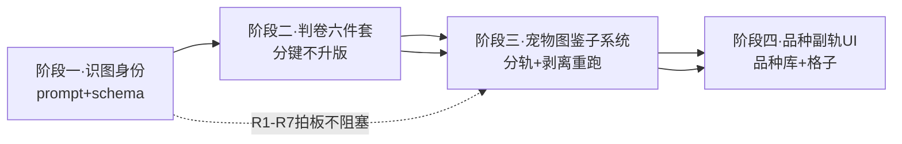

# 宠物/驯化副轨 · 施工备注（临时）

> **性质：施工备注，不是功能真源。** 查正式规格仍以 [`SPEC.md`](../SPEC.md) 为准；本文只服务「宠物/驯化副轨」这条线的分段施工与拍板记录；一段收口后结论写回正式文档再清空对应段落。
> 创建：2026-09-07；**2026-09-08 整理为移交版**（决策表 D1–D6c、各阶段完成线 §8、落点速查表 §9），接手 agent 从 §0 读完即可开工，无需原会话上下文。

## 0. 一句话总纲

不动「物种是唯一收录单位」的主轨，给驯化动物开一条**品种副轨**，同时修掉它暴露出的判卷层两股污染（名录冒领、缓存共座）。

## 1. 已拍板决策（2026-09-07）

| # | 决策 | 用户原话依据 |
|---|------|--------------|
| D1 | **身份层三元组**：个体身份 = 物种键(GBIF 折叠键) + 驯化位(dom/wild) + 品种(可空)。识图照常输出俗名与品种，结算时拆开 | 「身份层同意」 |
| D2 | **收集层仍按物种卡**：收录单位 = **(物种键, 驯化位)**。对绝大多数物种 dom 恒 wild，等于原物种卡；家犬/狼这类分裂物种同键不同位拆两张卡。品种是卡下格子，不拆卡 | 「收集层没问题，仍然按物种卡」 |
| D3 | **认到哪算哪（置信度阶梯）**：能确认驯化 → dom=true + 品种空；认得出标准品种 → dom=true + 品种名；不能确认驯化 → 按野生算（dom=false）；能认出是家猫但认不出品种 → 品种空，不收颜色系俗名（狸花/橘猫）当品种 | 「认不出的话就认到哪算哪……如果能认出是家猫 那就不填品种」 |
| D4 | **判卷层判卷对象 = (物种键, 驯化位)**，品种零参与。田园猫与金渐层同物种稀有度是有意设计（详见 §3） | 本文档 §3，待用户复核 |
| D5 | **现有图鉴/物种树不得在种下分亚种**（生物树严肃性），驯化收集走独立**宠物图鉴子系统**、与现有图鉴分轨。A' v1「现有图鉴内拆卡」被本条取代 | 「现有的除了套册以外的两个子系统，必然是不能在种下分亚种 不然生物树的严肃性被打破了」「可能得新加个宠物图鉴系统」（2026-09-08，方向初步认同，规则细定中） |
| D6 | **`domesticated` 题答案直供**（12 题保留、权重 `-1.0` 不变、不再二次问模型）：判卷对象升 `(物种键, 驯化位)` 后该题答案改由识图身份注入——dom 卷记 true（照扣 -1.0，家猫 SR 账不变）、wild 卷记 false（0 分），与名录四项查表注入同型（查身份不问模型）。该题对 wild 卷「问物种级驯化属性」的问错轴问题随答案来源切换消失 | 「对的 以后这题不用二次问模型了，权值不变直接用识图模型返回的」（2026-09-08） |
| D6b | **只认生物本体**（2026-09-08 改口）：驯化位只看家养型物种外观 / 品种外观。项圈、牵引绳、衣服、名牌**不得**用于判定驯养；室内、被抱、沙发、食盆等同理不得单独或与佩戴物拼凑推出 `dom=true`。`domesticated=true` 必须能指出 L1 本体证据否则降 null。流浪犬有家犬形态 → true。详见 §3.2 | 「我担心识图模型会做一些比如“照片中它呆在房子里”则就认为是驯养的」；「流浪犬显然是驯养种」；「项圈、牵引绳、衣服都不能认知它是驯养种——必须通过生物本体」（2026-09-08 改口） |
| D6c | **驯化卷锁室内否、常空手否**（2026-09-08）：身份注入三题 `domesticated=true` / `indoor=false` / `often_absent=false`，这三题不问模型。短窗口、分布窄**不锁**。打分时驯化种不走 indoor 扣分、不加常空手。不升 `scale3`；旧 `|dom` 缓存命中时本地回写 items/得分。家牛去掉常空手后 S=−0.5 仍是 SR | 「先小幅修改…处理下宠物就行」；去牧场基本能见家畜，常空手不该为真 |

待拍板：无。R1–R7 已于 2026-09-08 按产品默认收口（见 §4.1）。判卷层六件套已定；缓存**不升 scale3**，驯养另开 `|dom` 后缀。R2：dom 卷照判（开包要用），宠物卡不挂稀有度徽章。

## 2. 现状实锤：狼和狗现在就是同一张卡

完整链路（2026-09-07 代码核查）：

1. **识图**输出 `Canis lupus familiaris`（亚种级，`identify/prompt.ts` 现无驯化位/品种字段）。
2. **结算折叠**：`resolveTaxonKey` → `canonicalForTaxonKey`（`apps/api/src/volumes/taxonomy-resolve.ts`）种级强制二项名，`familiaris` 被砍 → taxonKey = `Canis lupus`。
3. **名录冒领**：`lookupListed`（`apps/api/src/rarity/cn-status.ts`）把折叠键也查一遍；`Canis lupus` 在 `cn-protected/list.json` 是**二级保护** → 家犬照片领走狼的 `class_ii +1.8`，直接 SSR 级。
4. **缓存共座**：缓存键 `scale2|CN|Canis lupus`（`apps/api/src/rarity/scale.ts`），家犬与狼谁先结算谁写档，后来者直接读。
5. **图鉴同卡**：`collection_user_taxon` 唯一索引 `(userId, taxonKey)`（`apps/api/src/db/schema.ts`）→ 狼狗必然一张卡，且卡的 commonName/scientificName 由最后结算的观察刷新。
6. **同案犯——家鸡**：`Gallus gallus domesticus` → 折叠 `Gallus gallus`（**红原鸡，二级保护**）→ 家鸡同样领 +1.8。家猫 `Felis catus` 无名录条目，无此污染，但与所有家猫品种共用一档。
7. **标定盲区实锤**：锚点表 [`rarity-calibrate-taxa.json`](../../apps/api/scripts/rarity-calibrate-taxa.json) 家犬键写的是 `Canis lupus familiaris`，与生产折叠键不同形——标定问的是「家犬」，生产评的是「狼」，标定全绿、生产翻车的机制根源。
8. **引入警报同病**：`introduced/index.ts` 的 `binomialKey` 砍亚种名，家犬的候选名落 `canis lupus`，会触发狼的引入条目。

## 3. 判卷层细化：田园猫和金渐层怎么不是「一个稀有度」

**答案：它们在物种轨上就是同一个稀有度，且这是有意设计；区分度全部移到品种轨（收集层格子）。**

三个理由：

1. **12 题评的是「遇见价值」**（体系定位：旅行抽卡遇见价值）。旅行中遇见金渐层和遇见狸花，都是「遇见家猫」这一件事；品种差异不改变遇见价值的主语。物种稀有度 = 家猫的稀有度（重判后约 SR），田园猫金渐层同卷同分。
2. **品种进判卷违原子性宪法**（「不存在一个理由两个必然」）。「纯种猫少见」这一个理由会同时命中 `habitat_common`（街上少）、`often_absent`（难偶遇）、`narrow_range` 三个题——一个理由收三题的钱，拆题失败。
3. **成本爆炸**：猫 70+ 认证品种 × 12 题 × 3 采样 × 国家，判卷调用不可接受。

**品种的「少见」体感给落点**：品种库每条带普及度三档 `common / uncommon / rare`（初版人工标注），表现为品种格的视觉区分（描边/角标）。**不叫稀有度、不进 12 题、不影响档位与 collectibleRank**。即「不是一个稀有度」的正确翻译是：**物种轨同稀有度，品种轨不同点亮难度**。

### 3.1 六件套（施工细化）

| 件 | 内容 | 落点 |
|----|------|------|
| ① 判卷对象 | 键升 `(taxonKey, dom)`；题面 `taxonBlock` **不改**学名（避免全量缓存失效）；`domesticated` 题从发模型批次摘出、结构注入 | `rarity/scale.ts` |
| ② 名录豁免 | dom=true → 名录四项（extinct/class_i/class_ii/sanyou）全豁免，断掉家犬领「狼 +1.8」、家鸡领「红原鸡 +1.8」；**展示层同豁免**：家犬卡不挂「国家二级保护」徽章（[serialize.ts](../../apps/api/src/serialize.ts) `tagsForNames` 依赖学名，需传 dom；[cn-status.ts](../../apps/api/src/rarity/cn-status.ts) `statusTagsFrom`） | `rarity/scale.ts` + web tags |
| ③ 缓存分键 | **不升** `SCALE_CACHE_VER`（保持 `scale2`）。键形：野生 `scale2\|{country}\|{taxonKey}`，驯养 `scale2\|{country}\|{taxonKey}\|dom`。家犬卷与野狼卷互不占座 | `rarity/scale.ts` |
| ④ 标定同步 | 锚点表键与生产同形（同走 `canonicalForTaxonKey` 折叠）+ 加 dom 位：家犬 = `Canis lupus`+dom、狼 = `Canis lupus`+wild；重判验收：家犬落 N–R（锚点表既定「N–R 均可接受」），狼保持 UR 级 | `scripts/rarity-calibrate-taxa.json` |
| ⑤ `domesticated` 题答案直供 | 题保留、12 题结构不变、权重不变；构造判卷题目时把该题拆为**结构注入项**：dom 卷固定注入 `true`、wild 卷注入 `false`，不进发模型的题面；`SCALE_ITEM_KEYS` 不变 → gate 分批、`item_compact` 编码、标定 CSV 列、管理后台判据面板全部不动；打分路径消费的 items 里 `domesticated` 项照旧存在，仅值来源变注入 | `rarity/scale.ts` + `scale-rubric.ts` |
| ⑤b 品种不进判卷 | `breed_zh` 零进 12 题（D4）——「纯种猫少见」会同时命中 indoor/habitat_common/narrow_range 三题，违原子性宪法；品种普及度三档只做格子视觉区分，不叫稀有度、不影响档位 | `rarity/scale.ts` |
| ⑥ 展示同步 | dom=true 的保护徽章、引入警报双豁免（与 ②④ 一致） | web tags + `introduced/index.ts` |

**答案直供的受影响面**（题保留，2026-09-08 修正）：

- 生产侧：`scale.ts` 构造题面时把 `domesticated` 项从发模型的批次里摘出、改注入值；`scale-rubric.ts` 题定义不动；[`scripts/rarity-replay-plan.ts`](../../apps/api/scripts/rarity-replay-plan.ts) L114 手写复刻打分路径（`if (yes(it.domesticated)) add(w.domesticated, "domestic")`）**照旧成立**，因为注入后 items 里该项照旧存在。
- 数据留痕：`rarity_cache.itemsJson` 仍为 12 键，schema 不变；`|dom` 分键不升版，旧野生缓存可继续用，驯养另开新键。
- 文档「12 题」表述全部无需改动。
- 标定脚本特殊处理：锚点表无 dom 位的历史行按 wild 卷跑（`domesticated` 注入 false），家犬锚点行加 dom 位后按 dom 卷跑（注入 true）——两种注入路径都要验收。

**标定验收五条**（⑥ 并入 ②，答案直供口径）：

1. 家犬 dom 卷落 N–R（锚点既定「N–R 均可接受」）
2. 野狼 wild 卷保持 UR 级
3. 家鸡不再领红原鸡 `class_ii +1.8`
4. 家猫维持 SR（锚点 id 59；`domesticated` 直供 true，-1.0 照扣）——**以锚点 JSON 的 user/agent 为准**（现表写 N）
5. 带/不带 dom 位两种注入路径都要跑通。全量 62+ 锚点回归不在本轮直播（避免无谓升 scale3 导致的全量重判）

### 3.2 驯化位从哪来

识图 prompt 新增字段：`domesticated: true|false|null`（null=不确定，按 D3 折到 wild）与 `breed_zh: string|null`（认不出标准品种或非驯化时为空）。填写规则照 D3 阶梯。**旧行不回刷**（既有原则，软档同例）；宠物类历史观察走后台「重算开包结算」通道逐条重跑。

**防场景/佩戴物污染（D6b，2026-09-08 改口）**：不得拿「呆在房子里」或「戴了项圈」当驯化证据。驯化位只认生物本体。

**判定原则：只看生物本体（家养型物种外观、品种外观）。场景与佩戴物不得参与判定。**

| 层级 | 证据类型 | 可定 `dom=true`？ | 示例 |
|------|----------|-------------------|------|
| L1 生物本体 | 家养型物种外观、品种外观 | **可以（唯一门槛）** | 家犬垂耳与吻部、英短圆脸、金渐层毛色格局、家鸡鸡冠与体型；街上无项圈的流浪犬、田园猫 |
| 佩戴物 | 人为附加物 | **不可以** | 项圈、牵引绳、衣服、名牌 |
| L2 行为/情境 | 与人互动、在室内 | **不可以** | 人抱着、客厅里 |
| L3 环境线索 | 纯背景 | **不可以** | 沙发、食盆、房屋、笼子 |

**判定矩阵**：

| 情形 | L1 本体 | 佩戴物 / L2 / L3 | → domesticated |
|------|---------|------------------|----------------|
| 本体是驯化型（流浪犬、田园猫、家鸡） | ✓ | 有无皆不论 | true（品种能认则 `breed_zh` 同步给） |
| 本体是野生型（狼、红原鸡、獾） | ✗（形态是野生的） | 有无皆不论 | false（项圈下的獾仍是獾） |
| 本体看不出家野 | ✗ | 有无皆不论 | null → 折 wild |
| 疑野化、家野形态冲突 | ✗ | — | null → 折 wild |

**落点**（三处）：

1. `identify/prompt.ts`：字段说明写进「只认本体」分层与判定矩阵（用户描述辅助地位已有先例：`用户描述（仅辅助，必须以图像视觉证据为主）`）。
2. 识图结果结构（`identify/types.ts`）：`dom_evidence_zh: string|null`，模型自报 L1 本体证据（如「L1:家犬垂耳与吻部」或「无L1:仅项圈+室内」），独立列落库。不进判卷、不进稀有度，仅审计。抽检「证据写了项圈却标 true」的错标。
3. 自检 prompt 收尾原则：`domesticated=true` 必须能指出 L1 **生物本体**证据，否则降 null。项圈/牵引绳/衣服/室内/沙发推不出身份。

**为什么不靠后端校验兜底**：dom=true 会大幅改判卷走向（-1.0 + 名录豁免 + 分轨入宠物图鉴），判断权在识图 prompt 一处落准，比事后审计省力且闭环。判断权单点落在识图 prompt，让一次识图出身份，判断与解释同源，判断与解释同源比事后审计便宜。判断权单点落 prompt，解释与判卷同源，错了用户一眼能看出来。

## 4. 分叉一方案 v2：宠物图鉴子系统（取代 A' v1，2026-09-08 方向拍板）

**用户方向拍板**：现有图鉴与物种树**不得在种下分亚种**（保生物树严肃性）；驯化收集与稀有度解耦，走独立**宠物图鉴子系统**。A' v1（现有图鉴内 `(物种键, 驯化位)` 拆卡）被此方向取代。

### 4.0 现状实锤（2026-09-08 代码核查）：「同一单元多稀有度」支持到什么程度

| 子系统 | 稀有度耦合现状 | 证据 |
|--------|----------------|------|
| 图鉴 `collectionEntries` | **一半支持**：每卡单 `rarity` 列，取历史观察最高档（**只升不降**）；观察行 `observations.rarity` 逐条独立 | [shared-progress.ts](D:/Fun/BioTrace/apps/api/src/services/shared-progress.ts) `upsertCollectionForUser`/`rebuildCollectionTaxonForUser`（`collectibleRankFromTier` 取 max 后写回卡） |
| 物种树 `treeModel.ts` | **零消费**：节点不存稀有度，只按 `got` 计数条目；节点 id = `<rank序号>:<拉丁名>`，种级即尽头 | [treeModel.ts](D:/Fun/BioTrace/apps/web/src/tree/treeModel.ts) `buildSpeciesTree`/`rollup`（`own: CollectionEntry[]`，无 rarity 字段） |
| 物种树详情视图 | **同零消费**：详情网格直接铺 `CollectionEntry`（图鉴卡），格子只有封面/俗名/学名，无稀有度字段；点格子跳 `/collection/species/<entryId>`（收集卡详情页）；`collectEntries` 上限 400 条/节点，超了显示「（显示前 400 项）」 | [SpeciesTree3D.tsx](D:/Fun/BioTrace/apps/web/src/components/SpeciesTree3D.tsx) `TreeDetail` + [CollectionTreePage.tsx](D:/Fun/BioTrace/apps/web/src/pages/CollectionTreePage.tsx) `onOpenEntry` → `navigate("/collection/species/${e.id}")` + [treeModel.ts](D:/Fun/BioTrace/apps/web/src/tree/treeModel.ts) L413 `collectEntries(n, cap = 400)` |
| 收集卡详情页 | **唯一消费点**：`rarity-badge rarity-${rarity}` 徽章 + `rarityLabel`（`rarity.${r}` 词条，缺词条时裸字符串兜底）；数据源 `getCollectionEntry(id)` 直接返回 `entry.rarity` | [CollectionSpeciesCardPage.tsx](D:/Fun/BioTrace/apps/web/src/pages/CollectionSpeciesCardPage.tsx) `` + `rarityLabel()` |
| 套册 `volumes` | **天然免疫**：槽位按配置匹配（目/科/属等），不认物种卡稀有度 | volumes 目录 grep rarity 零命中（仅 import gbif） |

**三处合起来的含义**：把 A' 的拆卡直接塞进现有图鉴会引入「亚种/驯化型卡片」破坏树与图鉴的种级严肃性；而树与套册对稀有度本就无耦合——**解耦是顺水推舟，不是逆天改命**。卡上唯一真正绑死稀有度的地方是「只升不降」聚合这一处。

### 4.1 已收口规则（R1–R7，2026-09-08）

- **R1 入口分轨**：dom=true 的结算不进现有 `collectionEntries`，进 `pet_collection_entries`。宠物图鉴按物种一张卡（家犬一张），品种是卡下格子。
- **R2 卡与稀有度**：观察仍走 12 题判卷（开包要用）；宠物卡**不挂稀有度徽章**。狼 UR 卡只存在于野生图鉴。
- **R3 品种格**：卡下品种格灰→彩；普及度三档只做描边区分，不叫稀有度、不进档位。
- **R4 数据迁移**：旧行不回刷。历史家犬 `domesticated` 缺省 false，要重识别才进宠物图鉴、离开狼卡。`rebuildCollectionTaxonForUser` 按野生源观察回缩。
- **R4b 名录/警报豁免**：dom=true 名录四项全豁免 + 徽章同豁免 + 引入警报不触发。
- **R5 现有图鉴侧（wild 侧）守恒**：dom=true 观察完全不触碰现有图鉴；确认为狼(wild)才点狼卡。
- **R5b 树上口径**：树上 `Canis lupus` 只统计现有图鉴（wild）。养狗空枝接受，不加提示。树零改动。
- **R6 套册不牵连**：套册照常点亮（家犬仍点亮犬科等槽）。
- **R6b 品种空**：独立「未认证」格始终在；田园猫/串串点这一格。不收狸花/橘猫/三花当认证品种。
- **R7 统计口径**：首页「收录 N」只计现有野生图鉴；宠物图鉴单独计数。

引入警报：`dom=true` 不触发（§7）。题面不改学名。

> 结构性风险提示：树/图鉴/套册对「同一物种不同稀有度」的既有约定是**演化的自由**（观察级独立+卡级只升不降），不是**个体的并列**（同键并列两档）。A' v1 的拆卡把「演化」强行扳成「并列」，这才是它伤树严肃性的机制根源。

## 5. 待拍板：品种普及度标记

- 品种库 `apps/api/data/breeds/`（初版 cat.json / dog.json，主流品种几十条，字段 `{ id, zh, en?, prevalence }`）。
- 普及度三档只做格子视觉区分，不叫稀有度、不进档位（§3 已论证）。
- 展示词需过术语表（`messages-glossary.mdc` 铁律）。
- 认证：识图 `breed_zh` 串 → 品种库精确/别名匹配 → 标准品种；不匹配 → 品种空（D3，不收颜色系俗名）。

## 6. 施工顺序（阶段依赖图）

1. **阶段一 · 识图身份**：prompt 加 `domesticated`/`breed_zh`/`dom_evidence_zh`（§3.2 三层证据矩阵写进字段说明）+ `observations` 加列（dom 缺省 wild）。旧数据不回刷。
2. **阶段二 · 判卷六件套**：§3.1 全表（`domesticated` 题答案直供；题面不改学名；缓存分 `|dom` 不升版）+ 锚点表键折叠同形。R2：dom 卷照判、宠物卡不挂徽章。
3. **阶段三 · 宠物图鉴子系统**：新表与分轨入口（dom=true 不进现有 collectionEntries）、wild 侧守恒、展示 tags 豁免。旧数据不回刷。
4. **阶段四 · 品种副轨 UI**：品种库、品种格灰→彩、普及度描边、独立「未认证」格。
5. **物种树**：零改动（树上零消费稀有度，宠物图鉴不上树或仅作独立计数来源，按 R5b 拍板）；不碰 `TreeScene.ts`。

**依赖关系**：阶段二依赖阶段一（dom 卷构造需要识图产出的 dom 位）；阶段三依赖阶段二（分轨入口消费判卷结果与名录豁免）；阶段四依赖阶段三（品种格挂在宠物图鉴卡上）。R1–R7 拍板不阻塞阶段一/二，但阻塞阶段三/四。

## 7. 遗留小分叉（不阻塞，阶段三前拍掉）

- 引入种警报对 dom=true 个体的处理。默认推荐：**不触发**（个体是家养的，跟着人走，不是「引入野生种群」语义）；澳洲街拍家犬不应弹「狼是引入种」。

## 8. 各阶段完成线（接手须知与验收）

> 接手 agent 必读：先读 [AGENTS.md](../../AGENTS.md) 与 [.cursor/rules/](../../.cursor/rules/) 下全部 `.mdc`（5 份），再读本文档。用户可见文案必须走术语表流程（`messages-glossary.mdc` 铁律）；提交说明用中文（`commit-messages-zh.mdc`）；设计方案先过再动手（`design-proposals.mdc`）；动服务器相关事项先读 `deploy-golden-rules.mdc`。**回答格式：工程对账/方案汇报按「现状 / 建议」两块组织。**

### 阶段一完成线（识图身份）

- [x] `identify/prompt.ts`：字段说明含 `domesticated`（true/false/null；只认生物本体，佩戴物/场景不算）、`breed_zh`、`dom_evidence_zh`（自报 L1 本体证据，仅审计用）。
- [x] `identify/types.ts`：`IdentifyResult` 加三字段；`extractIdentifyJson` 解析容错（缺省 null/空串）。
- [x] `observations` 表加列（drizzle schema + `ensureColumn`）：`domesticated`（缺省 false=按 wild 算，null 语义在识图层已折），`breed_zh`、`dom_evidence_zh` 可空文本。
- [x] 结算侧：识图结果 → 观察行字段贯通（identify 落库：合格 / 软档 / 留影档 / 过粗）。
- [x] 旧数据不回刷（旧行缺省 false）；宠物类历史观察待阶段三走后台「重算开包结算」，本阶段不加「待重算」列。
- 验收：用户实地跑识图（agent 不打识图配额）。管理后台观察详情能看见驯化位 / 品种 / 驯化证据三列即可对账。

### 阶段二完成线（判卷六件套）

- [x] ①键升 `(taxonKey, dom)`；题面不改学名；`domesticated` 从发模型批次摘出并注入。
- [x] ②dom=true 名录四项全豁免 + `tagsForNames` 展示层同豁免。
- [x] ③缓存分键 `|dom`，**不升** scale3。
- [x] ④锚点表加 dom 位、键与生产同形（家犬/家鸡折二项名）；补野狼锚点 id 63。
- [x] ⑤`domesticated` 题答案直供；`SCALE_ITEM_KEYS` 不动。驯化卷再锁室内否、常空手否（D6c），短窗口/分布窄不锁。
- [x] ⑥引入警报 dom=true 不触发。
- [ ] **验收五条**（代码已接好；本轮不跑 62 锚点直播）：家犬 N–R / 野狼 UR / 家鸡不领红原鸡 +1.8 / 家猫按锚点表 / 带与不带 dom 两种注入。

### 阶段三完成线（宠物图鉴子系统）

- [x] R1–R7 写入本文档。
- [x] 新宠物图鉴表 + 分轨入口（dom=true 结算不进 `collectionEntries`）。
- [x] wild 侧重建过滤驯养观察；身份翻转时对侧重算回缩。
- [x] 首页「已收录」只计野生；宠物单独一行计数。
- 旧行不回刷（要重识别才进宠物图鉴）。

### 阶段四完成线（品种副轨 UI）

- [x] 品种库 `apps/api/data/breeds/`（cat.json / dog.json / chicken.json）。
- [x] 品种格灰→彩；普及度三档描边；展示词过术语表。
- [x] 认证链路：`breed_zh` 精确/别名匹配；不匹配 → 点「未认证」。狸花/橘猫/三花不进库。

## 9. 落点速查表（按文件）

| 文件 | 角色 | 阶段 | 动作 |
|------|------|------|------|
| [identify/prompt.ts](../../apps/api/src/identify/prompt.ts) | 识图 prompt 模板 | 一 | 加 `domesticated`/`breed_zh`/`dom_evidence_zh` 字段说明 + 只认本体的判定矩阵 |
| [identify/types.ts](../../apps/api/src/identify/types.ts) | 识图结果结构 | 一 | `IdentifyResult` 加三字段 + 解析容错 + 落库折 wild |
| [identify/mock.ts](../../apps/api/src/identify/mock.ts) | 假识图 | 一 | 补三字段（树麻雀 = wild） |
| [db/schema.ts](../../apps/api/src/db/schema.ts) | drizzle schema | 一/三 | `observations` 加列；宠物图鉴新表 |
| [db/index.ts](../../apps/api/src/db/index.ts) | 启动迁移 | 一/三 | `ensureColumn` 三列；`pet_collection_entries` 建表 |
| [jobs/identify.ts](../../apps/api/src/jobs/identify.ts) | 识图落库 | 一 | 合格 / 软档 / 留影档 / 过粗 四条路径贯通 |
| [rarity/scale.ts](../../apps/api/src/rarity/scale.ts) | 判卷调度 | 二 | 键升 (taxonKey, dom)；`|dom` 分键不升版；身份三题注入；旧 `|dom` 缓存本地回写 |
| [rarity/scale-rubric.ts](../../apps/api/src/rarity/scale-rubric.ts) | 题定义/分批/打分 | 二 | `scaleBatchesForModel` 摘掉身份已锁的题；驯化种不走 indoor/常空手；题定义不动 |
| [rarity/cn-status.ts](../../apps/api/src/rarity/cn-status.ts) | 名录查表 | 二 | `lookupListed` 传 dom 豁免 |
| [serialize.ts](../../apps/api/src/serialize.ts) | API 序列化 | 一/二/三 | 观察三字段；`tagsForNames` 豁免；宠物卡序列化 |
| [admin.ts](../../apps/api/src/routes/admin.ts) + [AdminApp.tsx](../../apps/web/src/admin/AdminApp.tsx) | 管理后台观察详情 | 一 | 展示驯化位 / 品种 / 驯化证据，供实地验收 |
| [scripts/rarity-replay-plan.ts](../../apps/api/scripts/rarity-replay-plan.ts) | 复刻打分 | 二 | L114 路径照旧（注入后 items 含 domesticated 项） |
| [introduced/index.ts](../../apps/api/src/introduced/index.ts) | 引入警报 | 二 | dom=true 不触发 |
| [services/shared-progress.ts](../../apps/api/src/services/shared-progress.ts) | 图鉴聚合 | 三 | dom 观察进宠物表；wild 重建过滤驯养 |
| [services/pets.ts](../../apps/api/src/services/pets.ts) | 宠物图鉴聚合 | 三 | `rebuildPetTaxonForUser` |
| [routes/collection.ts](../../apps/api/src/routes/collection.ts) | 图鉴 API | 三 | `GET /pets` 必须在 `/:id` 之前 |
| [scripts/rarity-calibrate.ts](../../apps/api/scripts/rarity-calibrate.ts) + [rarity-calibrate-taxa.json](../../apps/api/scripts/rarity-calibrate-taxa.json) | 标定 | 二 | 锚点加 dom 位、键折叠同形；补野狼 |
| [CollectionPetsPage.tsx](../../apps/web/src/pages/CollectionPetsPage.tsx) / [CollectionPetCardPage.tsx](../../apps/web/src/pages/CollectionPetCardPage.tsx) | 宠物图鉴 UI | 三/四 | 列表 + 卡下品种格 |
| `apps/api/data/breeds/` | 品种库 | 四 | cat.json / dog.json / chicken.json |

> 树侧（`treeModel.ts` / `SpeciesTree3D.tsx` / `TreeScene.ts`）零改动（R5b 免费成立）；套册按 R6 照常点亮。
